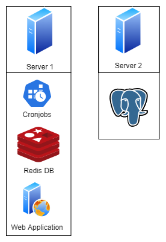

# Crypto Rating 

## Motivation and Goal 
The goal of the project is to provide an application, which should help to estimate a cryptocurrency's future price development,
by computing a sentiment_score based on user posts. Currently, the application only takes reddit posts into account. 
To project was created, due to a project work during our studies at the [HDBW](https://www.hdbw-hochschule.de/) bachelor program.

* * *

## Deployment



### Docker

There is a [docker-compose.yml](docker-compose.yml) and a [Dockerfile](Dockerfile) located in the root dir.
```shell
docker-compose build 
docker-compose up 
``` 

### TODO
There needs to an additional config.yml file added in the crypto_rating package. The file should look as follows:
```yaml
database.postgres.host: <HOST>
database.postgres.user: <USER>
database.postgres.password: <PASSWORD>
# When deployed via docker-compose setup database.redis.host should be 'redis:6379'
database.redis.host: <HOST>
database.redis.password: <PASSWORD>
```

[settings.py](/crypto_rating/settings.py) needs to be changed as followed, when deployed on a server: 

```python
ALLOWED_HOSTS = ['<Host>']
```

* * *

## Implementation 
The Project is split into multiple services, which should be deployed in production on two different server's. 
There was a big focus on keeping the applications loosely coupled, to make sure future changes are possible. 
This repository is supposed to provide the main Django WebApplication. 
The associated other applications may be found in an extra [repository]([https://github.com/Pondo18/crypto-rating-extra)


## Structure
The WebApplication is divided in multiple Django apps: 

- crypto app: 
    - Responsible to load the html page for a specific cryptocurrency
    - Models: 
        - Currencies: cryptocurrencies which will be analysed
        - AnalysedScores: materialized view, which contains an analysed sentiment score per currency per day

- reddit app: 
    - Models: 
        - Posts: Queried raw posts  
        - SentimentScores: Computed sentiment score for each post

- pages app: 
    - Returns and renders index page with list of top 6 cryptocurrencies 
    - Index page will be cached until new scores are available


## Roadmap
The project is currently in an early version. We are planning on continuously improving it. 

### Planned features
- In future the service may be provided through a rest-api, which can be openly used by other developers
- The rest-api could allow to divide the WebApplication in dedicated frontend and backend. Thus, the architecture may be changed to a single page application
- We plan to get our data from more sources (Twitter, News)
- It will be necessary to improve the artificial intelligence, computing the scores


## Credits & Collaborators
### Used sources 
- [Reddit-API](https://www.reddit.com/dev/api/)
- [Messari-API](https://messari.io/api)


### Collaborators
- [Dennis Hug](https://github.com/hugson-d)
- [Laurin Leiwes](https://github.com/NighthawkF119)